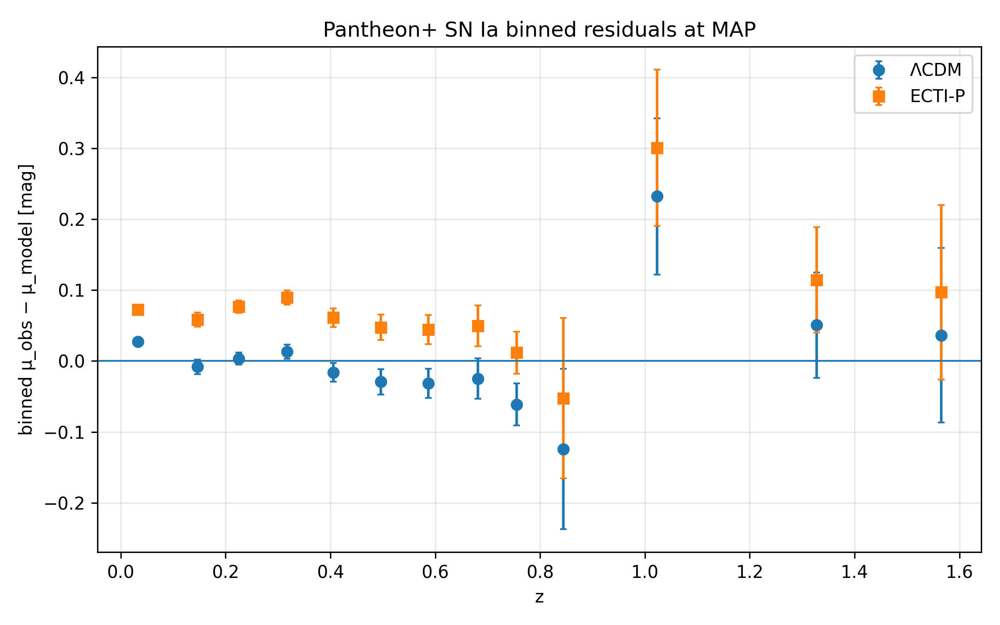
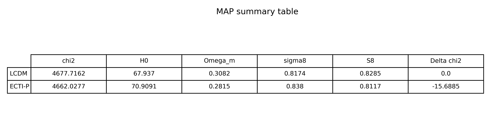
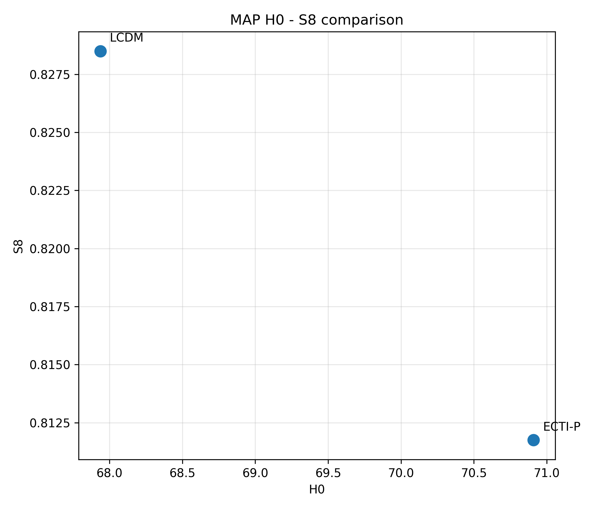
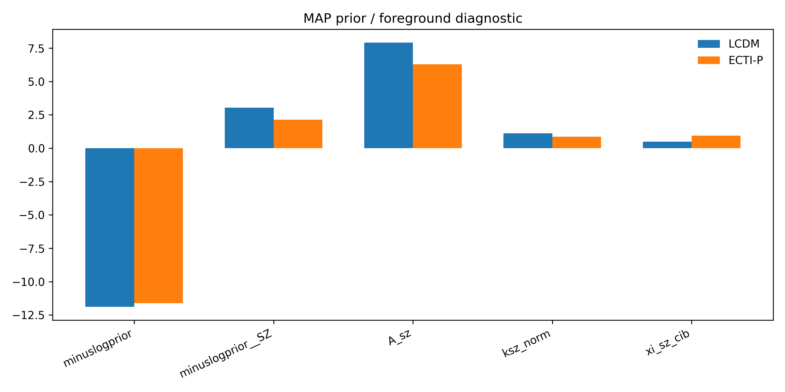
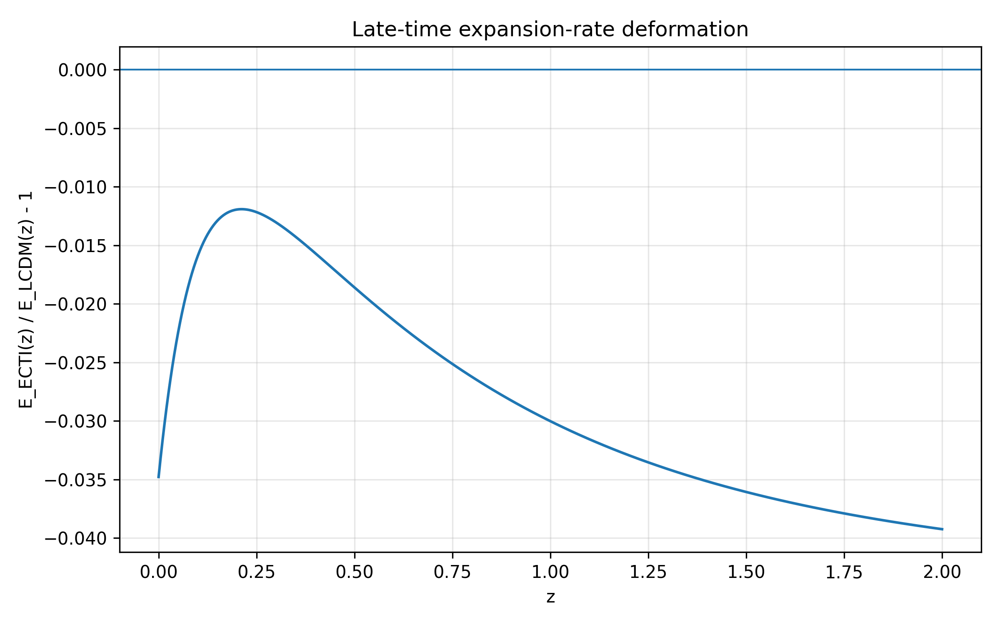
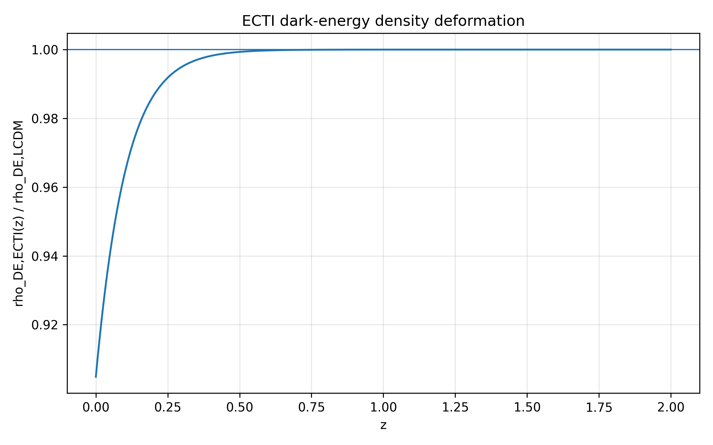
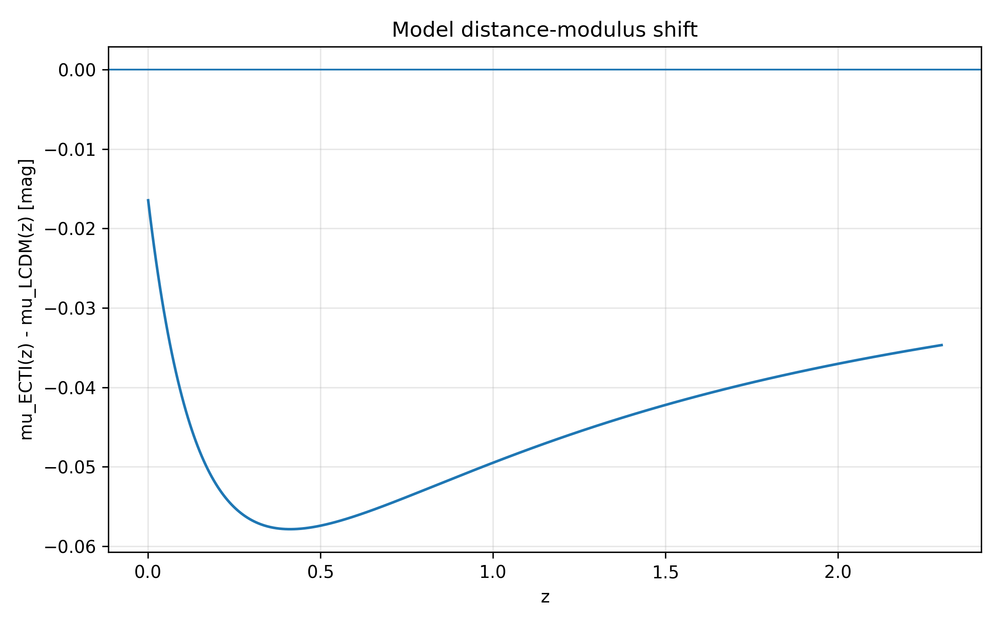

# ECTI-P vs ΛCDM — Full Likelihood (CLASS + Cobaya)  
### Late-time, background-only deformation of ΛCDM (hybrid implementation)

---

## Context

This repository presents the full-likelihood (CLASS + Cobaya) implementation of the ECTI-P model.

It extends the initial background-only analysis available here:  
👉 [ECTI-P background analysis](LIEN_VERS_TON_REPO)

The present work tests the same late-time deformation within a full CMB likelihood framework,
using Planck 2018 TT/TE/EE data and a Boltzmann solver.

The ECTI-P model is implemented as a nested extension of ΛCDM at the background level,
allowing a direct and controlled comparison while maintaining full compatibility with standard perturbation treatments.

This choice enables robust testing within existing Boltzmann pipelines,
pending the development of a fully self-consistent perturbation framework.
---

## Key result

  

**Δχ² = −15.69**  
**ECTI − ΛCDM, FULL PROBE, FAIR comparison**

- Same datasets, likelihoods, priors, and nuisance treatment  
- Same ΛCDM baseline parameter space  
- No early-time, recombination, or perturbation-sector modification  
- Main gain driven by SN Ia, with secondary contribution from cosmic shear  
- No significant degradation of the CMB likelihood  

---

## Interpretation of the gain

The improvement is driven by a controlled late-time deformation of the expansion history,
which propagates into luminosity distances and improves agreement with SN Ia data,
while leaving early-time observables (CMB) essentially unchanged.

This improvement is not uniform across datasets and is dominated by late-time probes.

---

## χ² breakdown (ECTI − ΛCDM at MAP)

  

**Contribution to Δχ² = χ²(ECTI) − χ²(ΛCDM) evaluated at the MAP.** 

Negative values indicate an improvement of ECTI-P relative to ΛCDM.

CMB: +0.24 | SN Ia: −15.40 | BAO: +2.64 | RSD: +0.34 | Shear: −3.50

The total improvement is dominated by SN Ia, with a secondary contribution from cosmic shear,
while BAO and RSD remain consistent and the CMB likelihood is preserved.

---

## SN Ia residuals at MAP

  

**Figure — Binned Pantheon+ SN Ia residuals at the MAP for ΛCDM (blue) and ECTI-P (orange).**  
Residuals are defined as μ_obs − μ_model and binned in redshift.

This plot illustrates the origin of the SN-driven χ² improvement: ECTI-P changes the redshift-dependent residual pattern relative to ΛCDM, reducing the mismatch that dominates the total Δχ² gain.

---

## MAP summary

  

**Figure — Maximum a posteriori (MAP) parameter values for ΛCDM and ECTI-P.**

Key shifts:
- Higher H₀ in ECTI-P  
- Lower Ωₘ  
- Shift toward lower S₈  

---

## H₀ – S₈ comparison

  

**Figure — Shift in the H₀–S₈ plane between ΛCDM and ECTI-P.**  
ECTI-P moves toward higher H₀ and lower S₈.

---

## Foreground / prior diagnostics

  

**Figure — Contribution of priors and nuisance parameters at MAP.**  
No evidence of artificial χ² improvement driven by nuisance parameters.

---

## Model behavior

  

**Figure — Relative modification of the expansion rate: E_ECTI / E_LCDM − 1.**  
Deviation is confined to low redshift (z ≲ 0.5).

---

  

**Figure — Effective dark energy density deformation induced by ECTI-P.**

---

  

**Figure — Induced shift in SN Ia distance modulus (model-only prediction).**  
The deformation aligns with observed SN residual structure.

---

## Model definition

The ECTI-P background expansion is defined as:

E²(z) = H(z)² / H₀²  
= Ωm (1 + z)³ + (1 − Ωm) exp[β exp(−z / zt)]

with:

- β = −0.10  
- zt = 0.10  

ΛCDM is recovered exactly for β = 0.

---

## Implementation

- Boltzmann solver: CLASS  
- Sampler: Cobaya  
- Background: modified via ECTI-P  
- Perturbations: ΛCDM standard treatment  
- Likelihoods: Cobaya + Cosmosis bridge for COSEBIs  
- No modification to early-time physics or recombination  

---

## Data

### Planck 2018 CMB

- `planck_2018_highl_plik.TTTEEE`
- `planck_2018_lowl.TT`
- `planck_2018_lowl.EE`

Reference: Planck Collaboration VI (2020), A&A 641, A6

---

### Pantheon+ SN Ia

- Pantheon+ (2022)  
- SH0ES calibration disabled  
- Full statistical + systematic covariance  

Reference: Brout et al. (2022), ApJ 938, 110

---

### BAO (DESI 2024)

- DESI 2024 BAO distance measurements  
- Observables include D_M / r_s and H(z) · r_s  

Reference: DESI Collaboration (2024), arXiv:2404.03002

---

### RSD

- 7-point fσ₈ compilation  
- Redshift range: 0.02 ≤ z ≤ 1.52  
- Includes 6dF, SDSS MGS, BOSS DR12, and eBOSS measurements  
- Implemented as independent Gaussian constraints  

---

### Weak lensing (KiDS-1000 COSEBIs)

- KiDS-1000 COSEBIs likelihood  
- Data file: `DES-Y3_xipm_and_KiDS-1000_COSEBIs_2.0_300.0.fits`  
- Only KiDS-1000 source bins used in theoretical modeling  
- Angular range: 2′ < θ < 300′  
- COSEBIs modes: n ≤ 5  
- DES Y3 data present in file but not used in this run  

Reference: Asgari et al. (2021), A&A 645, A104

---

## FAIR comparison

Both ΛCDM and ECTI-P use:

- identical likelihoods  
- identical datasets  
- identical priors  
- identical nuisance treatment  
- identical baseline parameter space  

The only difference is the late-time background deformation in ECTI-P.

---

## Parameter space

Baseline sampled parameters:

(H₀, ω_b, ω_cdm, n_s, A_s, τ)

Additional fitted parameter:

- M (SN absolute magnitude)

Derived parameters include:

- σ₈  
- S₈  
- Ωm  

---

## Robustness

- ECTI-P production run: 200k accepted samples  
- Independent validation run (100k samples)  
- Stable MAP region and Δχ² across runs  
- Convergence: R̂ ≈ 1.00–1.01  

---

## Limitations

- Background-only phenomenological model  
- ΛCDM perturbation sector assumed  
- Fixed deformation parameters β and zt  
- No underlying fundamental theory yet  
- RSD covariance treated diagonally  
- IA and photo-z nuisance parameters fixed  
- KiDS-only modeling within a combined DES+KiDS data file  

---

## Future work

- Full DES Y3 + KiDS joint shear modeling  
- DESI clustering / RSD likelihood integration  
- Free β and zt parameter exploration  
- Perturbation-level ECTI implementation  
- Independent external reproduction  

---

## Reproducibility

Main configuration:

`/root/ecti_planck/cosmosis2cobaya/inputs/chains/ECTI_FULLPROBE_200000_run1.updated.yaml`

All scripts, figures, and configuration files will be provided.
