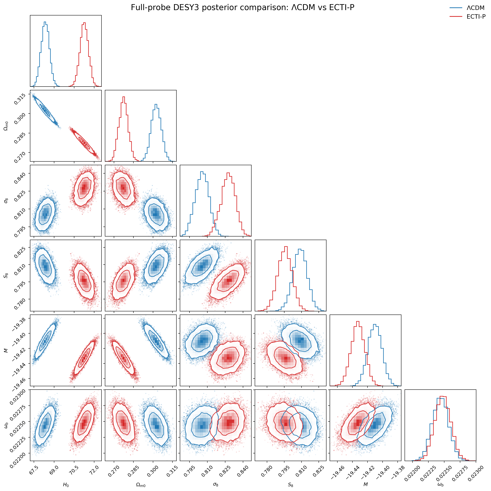
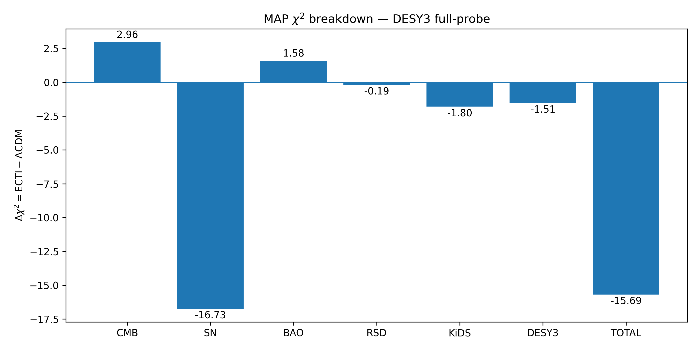
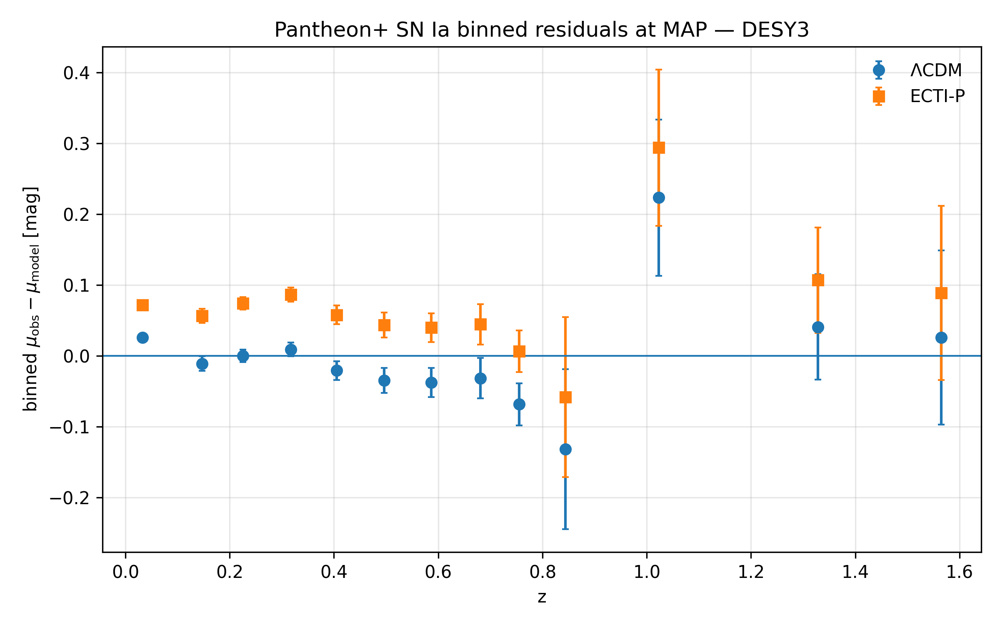
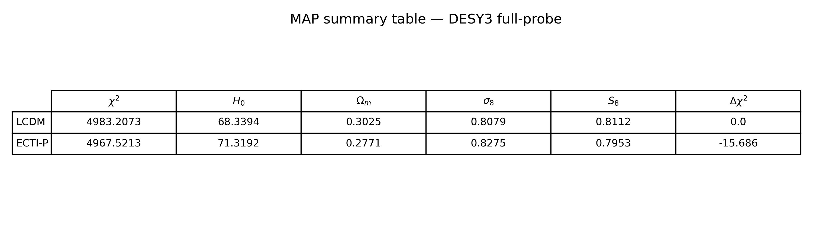
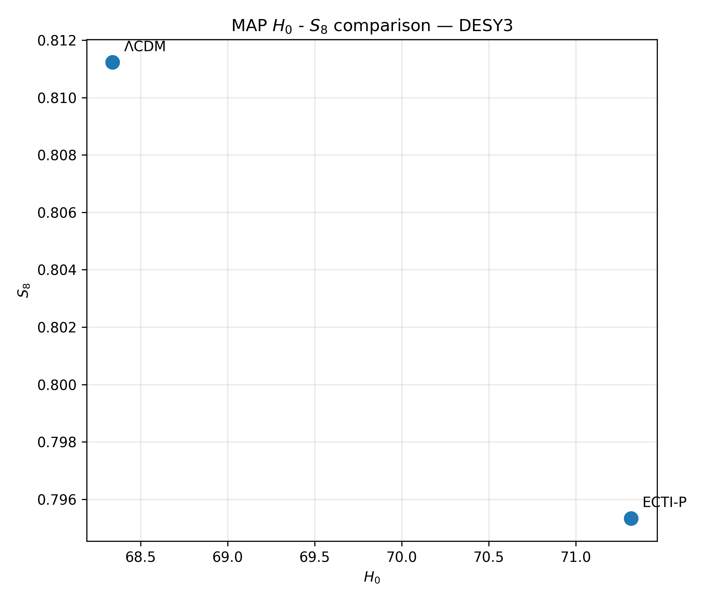
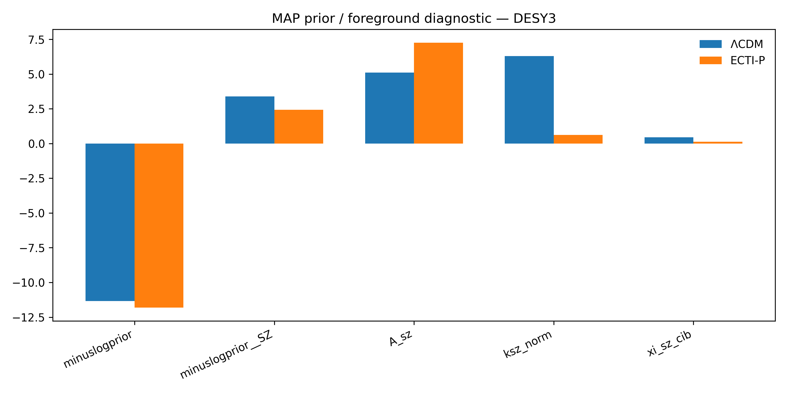
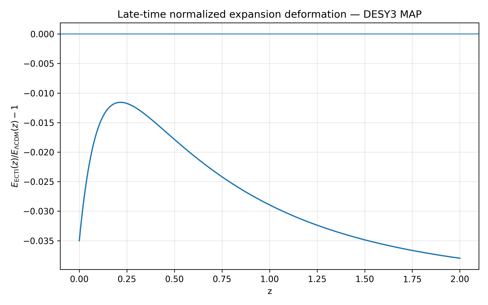
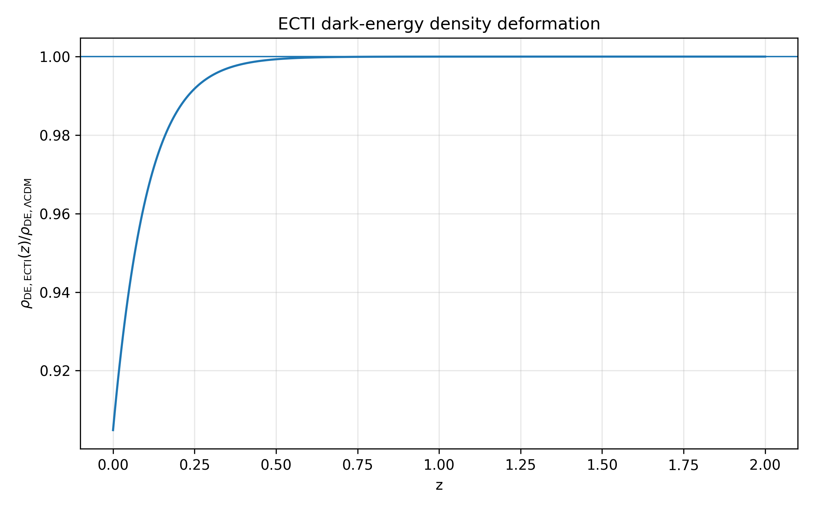
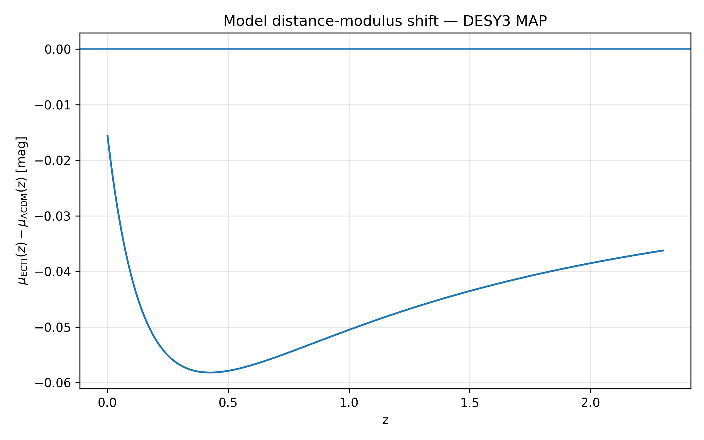

# ECTI-P vs ΛCDM — Full Likelihood (CLASS + Cobaya)
### DESY3-era full-probe analysis of a late-time background deformation of ΛCDM

[](https://doi.org/10.5281/zenodo.19983709)

> **Repository update (DES Year 3 integration):**  
> This repository was updated to include the DES Year 3 weak-lensing likelihood within the full-probe analysis pipeline.  
> The underlying ECTI-P model and its calibrated deformation parameters remain unchanged relative to the original release.  
> The update extends the observational dataset only, allowing a more stringent full-likelihood validation of the same phenomenological framework.

## TL;DR

Full-likelihood (CLASS + Cobaya) FAIR comparison between ΛCDM and ECTI-P:

- Δχ² = −15.69 (MAP)  
- H₀: 71.25 vs 68.34  
- S₈: 0.795 vs 0.809

Late-time background deformation improving late-time likelihood consistency while remaining compatible with the Planck 2018 full-likelihood framework.

---

## Context

This repository presents the full-likelihood (CLASS + Cobaya) implementation of the ECTI-P model.

It extends the initial background-only analysis available here:  
[ECTI-P background analysis (GitHub)](https://github.com/f-patellis/ECTI-P_vs_LCDM)

The present work tests the same late-time deformation within a full CMB likelihood framework,
using Planck 2018 TT/TE/EE data and a Boltzmann solver.

The ECTI-P model is implemented as a nested extension of ΛCDM at the background level,
allowing a direct and controlled comparison while maintaining full compatibility with standard perturbation treatments.

This choice enables robust testing within existing Boltzmann pipelines,
pending the development of a fully self-consistent perturbation framework.

---

## Key result

<p align="center">
  
</p>

- Improvement evaluated at maximum a posteriori (MAP)

**Δχ² = −15.69**  
**ECTI − ΛCDM, FULL PROBE, FAIR comparison**

- Same datasets, likelihoods, priors, and nuisance treatment  
- Same ΛCDM baseline parameter space  
- No modification to early-time or recombination physics
- Standard ΛCDM perturbation treatment retained 
- Main gain driven by SN Ia, with secondary contribution from cosmic shear  
- Moderate CMB and BAO degradation remaining subdominant to the late-time gain
---

## Interpretation of the gain

This improvement is not uniform across datasets and is dominated by late-time probes.

In particular, the gain originates primarily from the SN Ia likelihood, while the CMB likelihood and BAO show a moderate penalties that remains subdominant to the SN-driven improvement, RSD remain statistically consistent with ΛCDM.

This behavior is expected for a model that modifies only the late-time expansion history.

---

## χ² breakdown (ECTI − ΛCDM at MAP)

<p align="center">
  
</p>

**Contribution to Δχ² = χ²(ECTI) − χ²(ΛCDM) evaluated at the MAP.** 

Negative values indicate an improvement of ECTI-P relative to ΛCDM.

CMB: +2.96 | SN Ia: −16.73 | BAO: +1.58 | RSD: −0.19 | KiDS: −1.80 | DESY3: −1.51

The total improvement is dominated by SN Ia, with a secondary contribution from cosmic shear,
while the CMB likelihood and BAO show a moderate degradation, RSD remain statistically consistent with ΛCDM.

---

## SN Ia residuals at MAP

<p align="center">
  
</p>

**Figure — Binned Pantheon+ SN Ia residuals at the MAP for ΛCDM (blue) and ECTI-P (orange).**  
Residuals are defined as μ_obs − μ_model and binned in redshift.

This plot illustrates the origin of the SN-driven χ² improvement: ECTI-P modifies the redshift-dependent residual pattern relative to ΛCDM, reducing the mismatch that dominates the total Δχ² gain.

The positive shift in low-redshift residuals reflects the reduced expansion rate H(z) in ECTI-P at late times, which increases luminosity distances relative to ΛCDM. This behavior is a direct and expected consequence of the late-time deformation.

---

## MAP summary

<p align="center">
  
</p>

**Figure — Maximum a posteriori (MAP) parameter values for ΛCDM and ECTI-P.**

Key shifts:
- Higher H₀ in ECTI-P  
- Lower Ωₘ  
- Shift toward lower S₈  

---

## H₀ – S₈ comparison

<p align="center">
  
</p>

**Figure — Shift in the H₀–S₈ plane between ΛCDM and ECTI-P.**  
ECTI-P moves toward higher H₀ and lower S₈.

---

## Foreground / prior diagnostics

<p align="center">
  
</p>

**Figure — Contribution of priors and nuisance parameters at MAP.**  
No evidence of artificial χ² improvement driven by nuisance parameters.

---

## Model behavior

<p align="center">
  
</p>

**Figure — Relative modification of the expansion rate: E_ECTI / E_LCDM − 1.**  
Deviation is confined to low redshift (z ≲ 0.5).

---

<p align="center">
  
</p>

**Figure — Effective dark energy density deformation induced by ECTI-P.**

Effective dark energy density decreases from its normalized value at z = 0 toward an asymptotic value of exp(beta) at higher redshift.

---

<p align="center">
  
</p>

**Figure — Induced shift in SN Ia distance modulus (model-only prediction).**  
The deformation aligns with observed SN residual structure.

---

## Model definition

The ECTI-P background expansion is defined through the effective dark-energy density:

rho_DE(z) / rho_DE(0) = exp[ beta * (1 - exp(-z / zt)) ]

so that:

E^2(z) = H(z)^2 / H0^2
       = Omega_m (1 + z)^3 + (1 - Omega_m) * exp[ beta * (1 - exp(-z / zt)) ]

with fixed:

- beta = -0.10
- zt = 0.10

LCDM is recovered exactly for beta = 0.

---

## Calibration of deformation parameters

The deformation parameters (β, zt) are fixed to values calibrated from an independent background-only analysis.

This calibration is documented here:  
🔗 [ECTI-P background analysis (GitHub)](https://github.com/f-patellis/ECTI-P_vs_LCDM)

In that analysis, the parameter pair (β = −0.10, zt = 0.10) was identified as a stable minimum of the likelihood using a full late-time dataset combination.

The present work adopts these calibrated values to ensure a controlled and FAIR comparison with ΛCDM within a full-likelihood (CMB + LSS) framework.

Allowing (β, zt) to vary would introduce additional degrees of freedom and require a dedicated model selection analysis, which is beyond the scope of this study.
This separation ensures that parameter calibration and full-likelihood validation are performed independently.

---

## Implementation

- Boltzmann solver: CLASS  
- Sampler: Cobaya  
- Background: modified via ECTI-P  
- Perturbations: ΛCDM standard treatment  
- Likelihoods: Cobaya + Cosmosis bridge for COSEBIs  
- No modification to early-time physics or recombination  

ECTI-P is implemented as a hybrid background-level extension: the expansion history is modified, while perturbation equations are kept in the standard ΛCDM treatment. This avoids introducing an ad hoc perturbation sector before a self-consistent theory is developed.

---

## Data

### Planck 2018 CMB

- `planck_2018_highl_plik.TTTEEE`
- `planck_2018_lowl.TT`
- `planck_2018_lowl.EE`

Reference: Planck Collaboration VI (2020), A&A 641, A6

---

### Pantheon+ SN Ia

- Pantheon+ (2022)  
- SH0ES calibration disabled  
- Full statistical + systematic covariance  

Reference: Brout et al. (2022), ApJ 938, 110

---

### BAO (DESI 2024)

- DESI 2024 BAO distance measurements  
- Observables include D_M / r_s and H(z) · r_s  

Reference: DESI Collaboration (2024), arXiv:2404.03002

---

### RSD

- 7-point fσ₈ compilation  
- Redshift range: 0.02 ≤ z ≤ 1.52  
- Compilation of literature fσ₈ measurements (6dF, SDSS MGS, BOSS DR12, eBOSS-era)  
- Implemented as independent Gaussian constraints  

---

### Weak lensing (KiDS-1000 + DES Year 3)

The full-probe analysis includes both KiDS-1000 and DES Year 3 weak-lensing constraints.

#### KiDS-1000

- KiDS-1000 cosmic shear constraints
- External S8 reference used for tension comparison
- Reference: Asgari et al. (2021), A&A 645, A104

#### DES Year 3

- DES Year 3 cosmic shear likelihood
- Implemented through a Cosmosis-to-Cobaya bridge
- Integrated directly within the global full-likelihood pipeline

References:

- Amon et al. (2022), Phys. Rev. D 105, 023514
- Secco et al. (2022), Phys. Rev. D 105, 023515

The DESY3 integration constitutes an extension of the observational dataset only.  
The ECTI-P model, deformation parameters, and hybrid implementation remain unchanged relative to the original release.

---

## FAIR comparison

Both ΛCDM and ECTI-P use:

- identical likelihoods  
- identical datasets  
- identical priors  
- identical nuisance treatment  
- identical baseline parameter space  

The only difference is the late-time background deformation in ECTI-P.

---

## Parameter space

Baseline sampled parameters:

(H₀, ω_b, ω_cdm, n_s, A_s, τ)

Additional fitted parameter:

- M (SN absolute magnitude)

Derived parameters include:

- σ₈  
- S₈  
- Ωm  

---

## Robustness

## Robustness

- Stable MAP region recovered across independent runs  
- Consistent Δχ² preference for ECTI-P relative to ΛCDM  
- Posterior summaries derived from converged MCMC chains  
- MAP values used exclusively for χ² breakdown and diagnostic figures  

Dedicated nuisance and foreground diagnostics indicate that the observed improvement is not driven by pathological prior excursions.

---

## Limitations

- Background-only phenomenological model  
- ΛCDM perturbation sector assumed  
- Hybrid perturbation treatment: no dedicated ECTI-P perturbation equations are implemented  
- Deformation parameters (β, zt) fixed from independent calibration (not marginalized in this analysis)  
- No underlying fundamental theory yet  
- RSD covariance treated diagonally  
- IA and photo-z nuisance parameters fixed  

---

## Future work

- DESI clustering / RSD likelihood integration   
- Extension to a fully self-consistent perturbation framework  
- Independent external reproduction  

---

## Reproducibility

Main configuration:

`cosmosis2cobaya/inputs/chains/ECTI_FULLPROBE_DESY3_covrun.updated.yaml`

Some paths in the archived `.updated.yaml` files are machine-specific and must be adapted to the user's local environment.

This repository provides:

- configuration files (.yaml)
- likelihood implementations (SN, BAO, RSD)
- analysis scripts and figures

All chains, covariance matrices, and configuration files are publicly available on Zenodo:

https://doi.org/10.5281/zenodo.19983709

---

### Implementation note

The ECTI-P model relies on a modified CLASS background implementation.

Full reproduction of the pipeline requires:
- this CLASS modification,
- a working CLASS + Cobaya + CosmoSIS environment.

The present repository and associated archive provide all necessary configuration files and chains to verify the results independently. 

The modified CLASS implementation is provided in the Zenodo archive due to file size limitations on GitHub.

---

Due to the complexity of the CLASS + Cobaya + Planck likelihood environment,
full one-click reproducibility is not guaranteed.

However, the analysis can be reproduced within a properly configured environment.

---

## Citation

If you use these results, please cite:

Felipe David Jacques Miguel Patellis (2026)  
**ECTI-P vs ΛCDM — Full Likelihood (CLASS + Cobaya)**  
Zenodo. https://doi.org/10.5281/zenodo.19983709

```bibtex
@dataset{patellis_2026_ecti,
  author       = {Patellis, Felipe David Jacques Miguel},
  title        = {ECTI-P vs ΛCDM — Full Likelihood (CLASS + Cobaya)},
  year         = 2026,
  publisher    = {Zenodo},
  doi          = {10.5281/zenodo.19983709}
}
