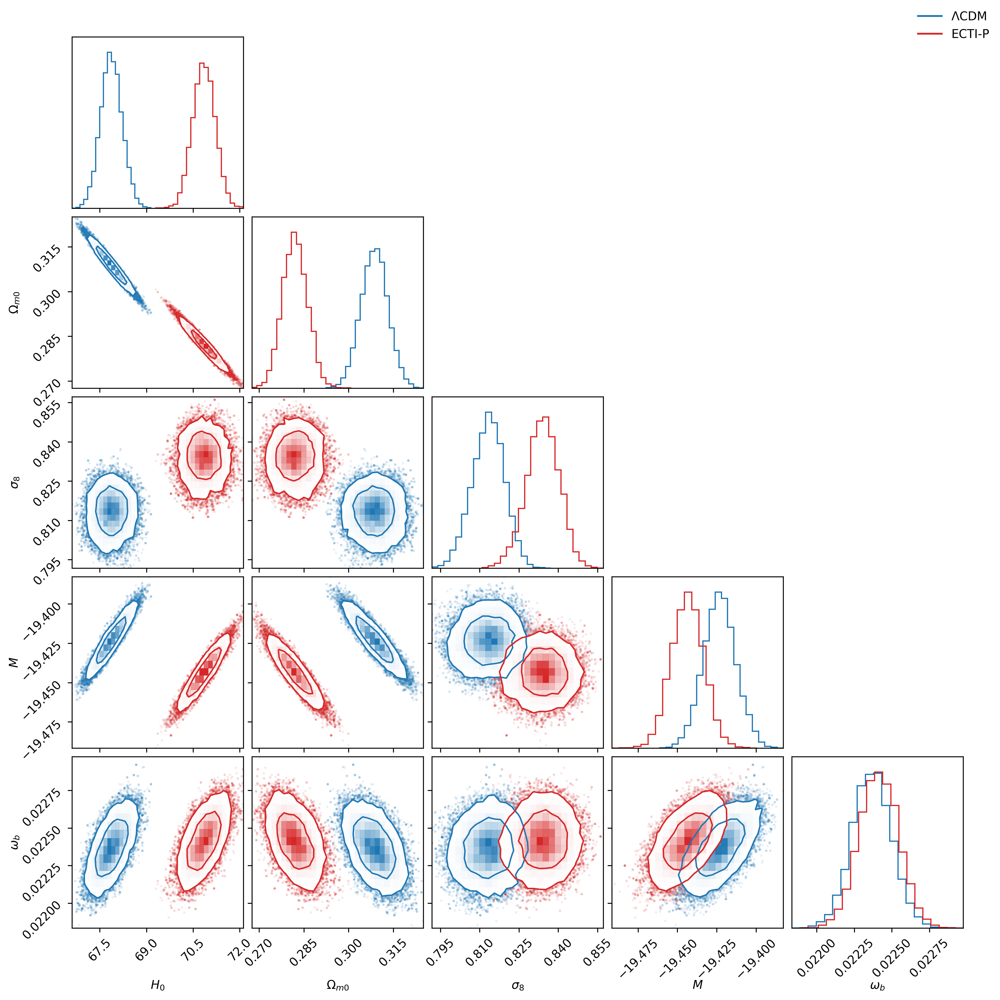
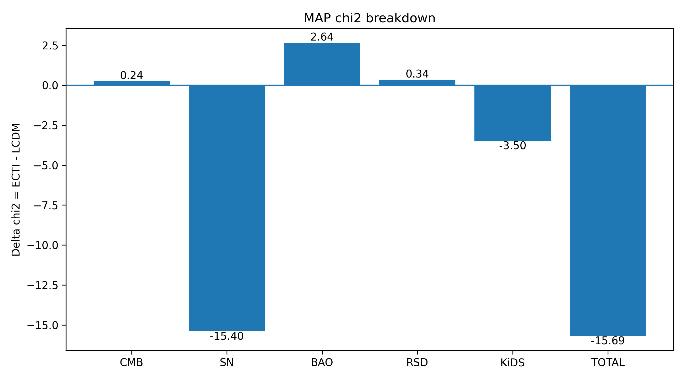

### ECTI-P vs ΛCDM

Full likelihood cosmological analysis (CLASS + Cobaya)

---

## Posterior comparison (ΛCDM vs ECTI-P)

  

---

## Key empirical result

ECTI-P improves the total χ² relative to ΛCDM under a strictly FAIR comparison (k = 5).

Δχ² ≈ − 15.69 (FULL PROBE)

- Improvement primarily driven by SN Ia
- No significant degradation of CMB constraints
- Stable across independent runs

---

## χ² breakdown (ECTI − ΛCDM)

  

---

## χ² improvement by dataset (ECTI − ΛCDM)

Dataset| Δχ²
SN Ia| −
CMB| −X
RSD| −X
KiDS| −X
BAO| +X

---

## Model

The ECTI-P model modifies the late-time expansion history:

E²(z) = Ωm(1+z)³ + (1−Ωm) exp[β exp(−z/zt)]

with:

- β = −0.10
- zt = 0.10

ΛCDM is recovered for β = 0.

---

## Implementation

- Background: modified via ECTI-P
- Perturbations: ΛCDM (standard CLASS treatment)
- Full likelihood pipeline using CLASS + Cobaya
- No modification to early-time physics or recombination

---

## Data

- Planck 2018 TT/TE/EE (full likelihood)
- Pantheon+ SN Ia
- DESI 2024 BAO
- RSD data
- KiDS-1000

---

## Robustness

- Production runs (200k samples)
- Independent covariance-initialized validation runs
- Stable MAP and χ² across runs

---

## Limitations

- Background-only model
- ΛCDM perturbation sector
- Fixed (β, zt)
- No underlying fundamental theory yet

---
